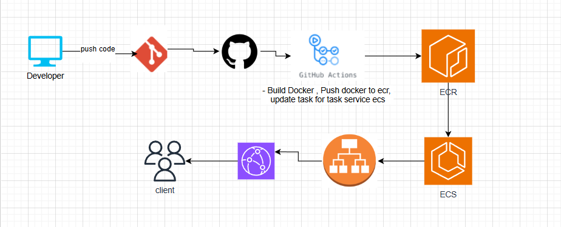

# CI/CD Pipeline with GitHub Actions, AWS ECR, and ECS

## Overview
This repository contains a CI/CD pipeline setup for automating the deployment of a Dockerized application to AWS ECS (Elastic Container Service) using GitHub Actions. The pipeline builds a Docker image, pushes it to AWS ECR (Elastic Container Registry), and deploys the updated service to ECS.

### Architecture Diagram

Developer --> GitHub --> GitHub Actions --> ECR --> ECS | | | Client ------------------> GitHub ECS

### Explanation:
- **Developer**: Pushes code changes to the GitHub repository.
- **GitHub**: Hosts the source code.
- **GitHub Actions**: Automates the build, push, and deployment process.
- **ECR**: Stores the Docker images.
- **ECS**: Runs the application as a containerized service.
- **Client**: Accesses the deployed application via ECS.
